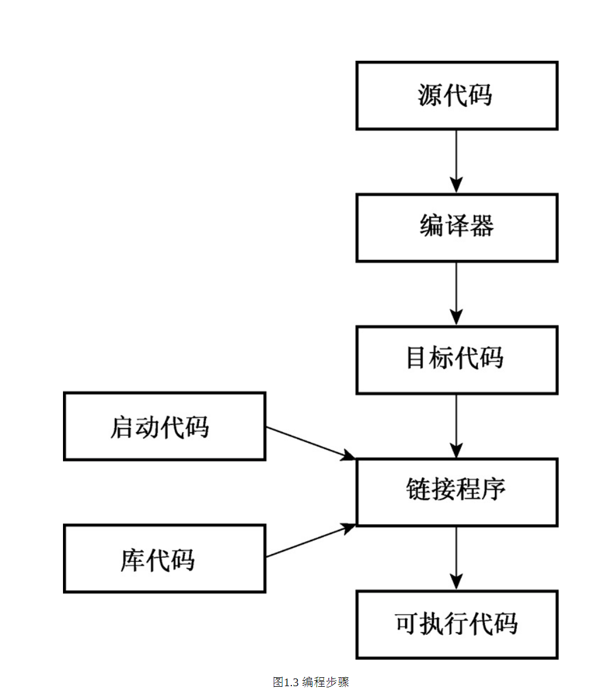
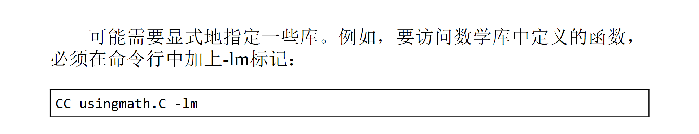
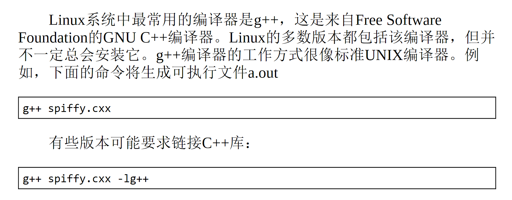
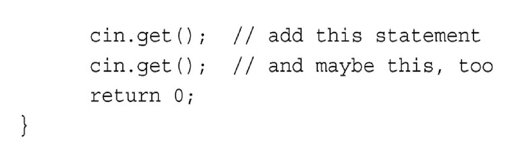
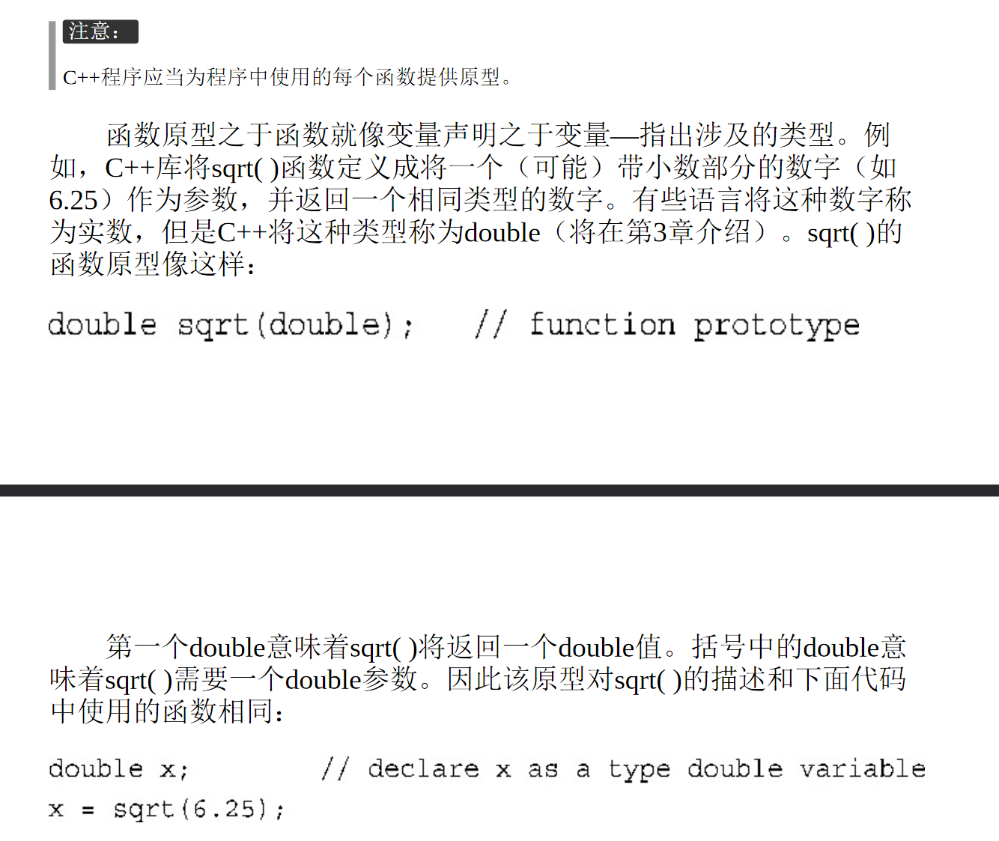
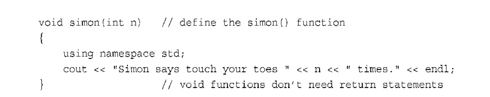
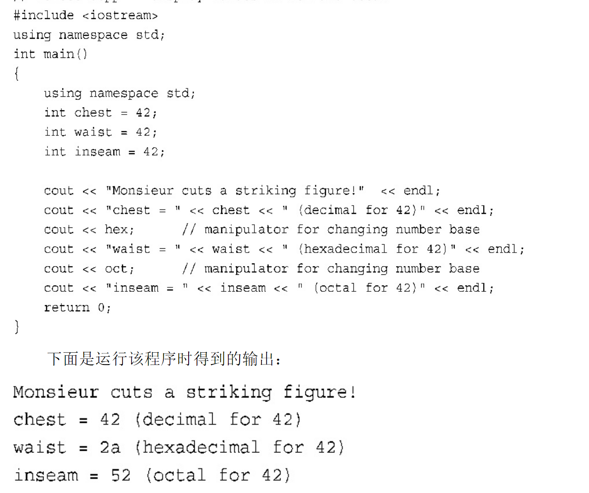
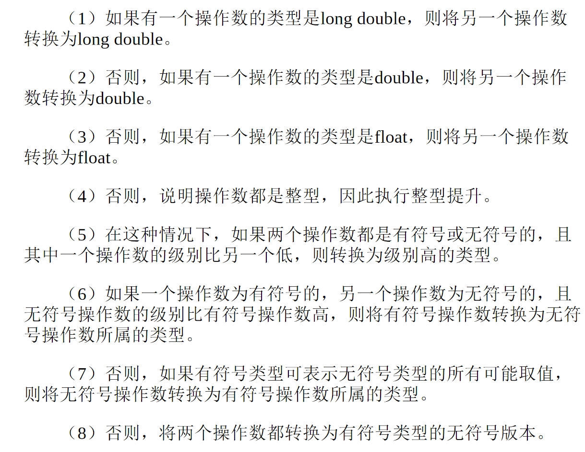
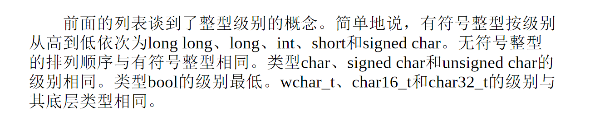

泛型编程:  
一个程序可以对多种数据类型的输入起效



### in unix

>CC xxx.cpp  
>生成 xxx.o

接着编译器将目标代码文件'xxx.o'传给**系统链接程序**  
此程序将代码和库代码结合  
并生成一个可执行文件默认为`a.out`

同样 如果有多个源代码 则

>CC 1.cpp 2.cpp

存在多个源代码文件时  
.o文件不会被自动删除 

此时如果修改了`1.cpp`  
则可以直接



(这是为什么)

>CC 1.cpp 2.o

### in linux

>g++ 1.cxx



(这是为什么)

直接生成a.out

同样支持

>g++ 1.o 2.cxx

>创建好项目后，需要对程序进行编译和链接。IDE通常提供了多个菜单项，如Compile（编译）、Build（建立）、Make（生成）、BuildAll（全部建立）、Link（链接）、Execute（执行）、Run（运行）和Debug（调试），不过同一个IDE中，不一定包含所有这些选项。


>- Compile通常意味着对当前打开的文件中的代码进行编译。
>- Build和Make通常意味着编译项目中所有源代码文件的代码。这通常是一个递增过程，也就是说，如果项目包含3个文件，而只有其中一个文件被修改，则只重新编译该文件。
>- Build All通常意味着重新编译所有的源代码文件。
>- Link意味着（如前所述）将编译后的源代码与所需的库代码组合起来。
>- Run或Execute意味着运行程序。通常，如果您还没有执行前面的步骤，Run将在运行程序之前完成这些步骤。
>- 编译器可能让您选择要生成调试版还是发布版。调试版包含额外的代码，这会增大程序、降低执行速度，但可提供详细的调试信息。

有些闪退的IDE在查看输出的时候要使用:



因为`cin.get()`负责读取下一次 键盘输入

## 2章

```
#include <iostream>

std::cout

```

和下面等效

```
#include <iostream.h>

cout

```

既可以

```
using namespace std;

```

或者

```
using std::cout

```

赋值连续使用

```
a = b = c = 2
```

2赋给c  
c的值赋给b  
b赋给a

```
printf('%s',"25")
printf('%d',25)
```



函数原型和函数声明的不同之处:
- 函数原型规定了接受的输入和输出 使编译器知道如何检查函数的使用
- 函数声明真正负责实现函数的功能

函数原型以分号结束  
而函数声明需要大花括号




这样使用using:

```
int main(){
    using namespace std;
    ...
}
```
可以只在main 内使用名称空间

sizeof 运算符(?)

`sizeof a` 会变成 a 的长度  
而对类型使用sizeof的时候应该要`sizeof (int)` (?)   

无符号类型

```
unsigned int a #无符号整型
unsigned a #同样无符号整型

```



使用cout输出不同进制的数字  
在此处  
hex相当于传入cout的消息, 并且hex 是 std::hex  
因此在using之后  
hex不能作为变量名

并且, cout 将输入流中的数字默认存储成int  
使用
```

cout << 2022UL;
```
表示要存成 unsigned long  
被称为后缀, 同样使用ULL 可以存成unsigned long long

unsigned int 比较适合用来表示地址

cin和cout都会根据数据类型去转换输入->存储和 存储->输出

C++对字符使用单引号  
对字符串使用双引号

cout也可以同时处理字符串和字符  
同样, `cout.put()` 可以只输出一个字符

char  
char就是表示一个字节  
因此char有无符号特别重要  
可以用signed char 和 unsigned char 显式指定  
如果直接char就都有可能

宽字符集  
用 wchar_t 来申明宽字符  
宽字符可能在不同的系统上有不同的表现 (2字节 or 4字节)   
在这种情况下  
cin 和 cout 将输入视作 char 流  
因此不适用 wchar_t 类型  
而iostream 提供了 wcout 和 wcin 为了处理这种

类似的  
char16_t 长16位无符号  
char32_t 长32为无符号  

```
wchar_t a = L'P'; //L指示存储为宽字符
char16_t a = u'P'; // u指示存储为16位
char32_t a = U'P';

```

```
bool a = true;
bool a = -100; //都会让 a 成为 true

int b = true; //让 b 变成 1


```

const 加在任何变量申明前 申明的变量是不可修改的

```
//拒绝这样做
const int a;
a = 2; //太晚啦

//应该这样
const int a = 2;

```

`7.2e+15` 这是 e 表示法

浮点类型  
float 32位  
double 64位  
long double 80 96 或者是 128 位   

可以更改 `cfloat.h` 中的内容来改变 浮点数的有效位数(?)

```

std::cout.setf(ios_base::fixed, ios_base::floatfield); //固定浮点
// 这句话让cout不会删除掉输出末尾的 0 
```

```
1.2f //属于float
1.2F //float
1.2 // double
1.2L //long double

```

如果在除法的时候  
两个操作数都是整数 则cpp执行整数除法  
有任何一个是浮点数就执行浮点除法  

同样
```
1.2 / 2.3 //double 除法
1.2f / 2.3f //float 除法
1.2L / 2.3L //long 除法
```

如果把一个short赋值给long  
则会将short扩展 变成long  

反之将long赋值给short  
则会只赋值低几位  

将浮点赋值给整型会出现问题  
一个是小数部分会被截断  
并且可能浮点对整型太大了  
没有规定编译器应该对这种情况做出什么

不允许缩窄转换  
```
long = {int} //可以因为保留了所有信息
int = {long} //不可以

```





强制类型转换 `long (a)`

```
(long) a //创建一个新的变量类型long 值为a的
long (a)  //同上

//或者是
static_cast<long> a //也可以, 但是要求更加严格


```

数组

`short a[10]`

使用`sizeof a` 可以得到 类型 \* 数组长度 的占空间  
`sizeof a[0]` 返回 类型所占字节数   
`int cards[3] = {20, 30, 5};`来赋值  
对于数组, 就不能`cards1 = cards2;`
`int cards[3] = {1,2};` 就只能初始化前两个元素, 其他元素设置为0  
`int cards[100] = {0};` 编译器会让所有的元素都被初始化为0  
`int cards[] = {1,2,3,4};` 会变成长度为4的cards  
**列表初始化禁止缩窄转换**  

```
char a[] = {'1','a','b','\0'}; // 这是字符串   如果没有最后的\0就不是字符串
char a[3] = "mi" // 编译器会理解 \0
char a[] = "mifaso"  //c对字符串长度没有限制  

```

`'S'` 表示的只是S的ASCII 相当于 83  
但`"S"` 是 S 和 \0 组成的字符串  
并且尝试`char a = "S";` 表示的是字符串所在的内存地址  

```
#include <cstring> //为了strlen()
int main(){
    char a[] = "qwer";
    //此时 strlen(a) 返回有多少字符 这里是4个
    //此时 sizeof(a) 返回有占多少个字节 (包括未使用的空字节) 这里是5个 记住要算 \0 的占位

}

```
**注意strlen 只计算可见的字符 空字符并不算在其中**  
**提前 \0 的位置会让字符串提前结束! 哪怕后面还有内容!!**  

cin 使用空白字符来确定字符串结束位置    **空格  制表符  或者换行符**  

`cin.getline(a,20)` 可以将 一行 少于19个字节的语句 抛去最后的换行 写入到a 内  
相当于使用 \0 来替换换行符  

`cin.get(a,20)` 则不会从输入管道中读取换行符, 而是直接将他留在原位置, 连续使用两个cin.get()会导致第二个读入0字节  
```
//但是可以这样
cin.get(a,20);
cin.get(); //换行
cin.get(b.12);

//这么写 读入并换行
cin.get(a,20).get();
//这么写 相当于使用两次getline()
cin.get(a,20).get(b.20);
```

cin.get在读取空行之后会设置 **失效位**  
意味着接下来的输入将被阻断  
cin.clear(); 可以清除这种阻断  

在输入比分配的空间长时  
get 和 getline 都会把剩下的字符留在队列中  
同时getline 会设置失效位, 关闭后面的输入  

总之  
**getline使用起来更容易  而get 方便检查错误**  

一个例子  

```
int year;
cin >> year;
cin.getline(a,20);

```
在运行时完全没有机会可以输入a  
这是因为year在读取的时候不会干掉换行符  
而getline遇到了换行符因此结束  

于是要
```
cin >> year;
cin.get();

//或者是

(cin >> year).get();

```

## string

std::string 隐藏了字符串和字符数组的不同点  

```
#include <string>

string a = "123321";
cin >> a;

```

不同之处在于  
string可以被初始化为简单变量  
而不是数组  
str的声明可以创建一个 0 长度的string  
然后在读入输入的时候自动调整str的长度  

`string a = {"123321"}` 也是可以的  

**cpp里不能将一个数组赋值给另一个数组 但是, string可以赋值**  

同样 字符串拼贴类似python  
`str3 = str2 + str1;`  
甚至可以  
`str2 += str1;`  

赋值字符数组 `strcpy(char1,char2);`   
连接字符数组 `strcat(char1,char2);`

而 strncat 和 strncpy 提供了第三个参数   指出了目标数组允许的长度  
从而更加安全了  

strlen 是 统计字符个数直到遇到 \0  
因此对未初始化的 char 数组使用 strlen 则会出现**char 内没有\0 直到许多字节后才会出现 \0**  
这就导致了, strlen 甚至会远大于 char 数组的长度  

而初始化前 的 str 则长度为0   
str.size() 也会说是 0

有一个不是类方法的getline :  
`getline(cin,str); //这里不是ste::cin.getline 而是 istream 类的一个方法`

```
wchar_t a[] = L"123321";
char16_t a[] = u"123321";
char32_t a[] = U"123321";
```

原始字符串  
相当于python的r""  
但不一样的是  
在其中使用 "" 都不会有问题  
`str = R"( 我是一个字符串 \0 \n 并且只有一行 """"""""''' )";`

输入原始字符串的时候  
按回车键会将光标移动到下一行  
并且会在原始字符串中添加回车字符  

如果使用`"+*()*+"` 就可以在中间使用 "()" 了  

原始字符串 可以自定义**定界符**  

在标识wchar_t时  
R和U的顺叙可以任意指定


## struct

```
struct a{
    int b;
    float c;
    char d;
}

//接着

a hat; //用于创建变量
a foo = {
    12,
    1.2,
    '2'
}; //不能忘记分号

```

在申明struct 的时候  
外部的声明可以用在所有的内部函数中  
但是函数内的声明只能用在内部

struct 不允许缩窄

struct 允许占位
```
struct a{
    unsigned int ab : 4;
    unsigned int : 4; //没有使用的4bits 
};

而初始化则
a new_para = {2};
少输入一个参数

```

共用体   
创建时被称为共用体  
使用时可以是 int 或者 float 或者其他  
但不能同时存储不同数据类型的数据

使用方法和结构体共同使用  
避免了因为某个字段类型不同而必须申明两个结构体

```
union all{
    int int_val;
    long long_val;
};

all a;
a.int_val = 4;
a.long_val = 4444444444444;

//用在结构体重

struct xxx{

    union id {
        long long_val;
        int int_val;
    } id_val;
};
xxx foo;
cin >> foo.id_val.int_val;

//匿名共用体

struct baz{
    union{
        char char_val;
        int int_val;
    };
};
baz yyy;
cin >> yyy.char_val;

```

枚举

```
enum foo {app, bananana}; //创建枚举体

foo baz;

baz = app; //可以的
baz = 2; //不行

```

对于枚举  
只定义了赋值运算符  
意味着自增运算 减法运算等运算都非法  
**枚举量是整型!**

```
int c = app; //可以的, 转换为int
c = 3 + bananana; //也是可以的

```

在算数表达式中  
枚举量会被转化为整型  
因此
app + banana 会是 0 + 1 等于一个整型

申明指针

```
int * pointer;

```

用 new 找到一片合适的内存

```
int * p = new int;

delete p;

```

delete 只允许作用于 new 分配的内存  
如果内存来自于其他的变量 &a  
则delete失效

```
int  * pt = new int [100];
//直接用pt[12] 来访问元素
pt = pt + 1; //指向下一个元素
// 由于int 是长4字节
// 因此对于指针而言, 运算在这里有特别的处理
delete [] pt;

```

`stacks[1]` 效果等于 `*(stacks  + 1)` 

数组名和指针唯一的区别就是  
`指针 = 指针 + 1; // 可以而数组不行`

cpp将数组名视作指向数组第一个元素的地址  

```
int taco[10];
// 现在 taco == &taco[0]

```

当对数组名使用 `sizeof` 的时候  
返回整个数组的长度

数组指针相加减的最小单位就是元素长度  

string 传递的是头  
因此  
必须对string 进行深拷贝  

```
#include <iostream>
#include <cstring>

int main(){
    char animal[] = "312";
    char * ps; //未初始化的

    ps = animal; // 会让这两个数组指向同一个地址
    ps = new char[strlen(animal) + 1]; //重新初始化ps的地址 未初始化的指针是危险的!
    strcpy(ps, animal);
    // 这样才完成了复制
}


```

`const char * bird = "www";`

strncpy 是安全版本的 strcpy  
接受第三个参数  
表明最多允许多少个复制  
第三个参数最大设置成最大长度 - 1  
来给最后的空字符留下位置

**在初始化之外, string 应当这样赋值:**  
```
char food[20] = "banana";
strcpy(food,"other food");

```


动态结构成员访问

```
struct thing{};

thing foo = {1,2,3};
thing * pt = &foo; //此时pt是动态结构

//foo.name == (*pt).name == pt->name

```

静态存储 : `static double xxx;`  
自动存储 :  调用函数时产生的变量自动存储 在函数 return 后自动释放
动态存储 : new delete (存储在 free store 或者是 heap中) 此种数据的生命周期并不由创建之的函数决定, 而更加灵活

在栈中, 自动存储使占用的内存总是连续  
但动态存储分割内存使得其不连续

`int s1, s2, s3;`


**vector 和 array 是 数组 的 替代品**

```
vector<int> vi;  %零长度 vector 数据类型为int

vector<type> name(n); %声明一个定长的


```

array 使用 **静态分配内存** 而不是自由存储区, 因此更快

```
array<int, 5> ab = {1,2,3,4};


```

**可以直接将一个array赋值给另一个array**   
而数组必须逐元素复制

在array中`a[2] 的效果相当于a.at(2)` 但使用at进行了检查 这牺牲了时间  
往往包含 a.begin() 和 a.end()

```
int i;
for (i = 0;i<5; i++){ // for 和 后面的括号之间是有一个空格的
    pass
}

```

相当于是

```
i = 0;
do
    if !(i < 5) break
    else i++ and do sth
loop

```

**for 语句先检测 再执行 最最后更新, 因此 i<5 时 i 不可以取到 5**

`a++` 的 return 值仍然为 a  
`++a` 的 return 值为 a + 1


```
// 这样是可以的, 定义一个临时变量temp

int main(){
    int x; //永久变量
    {
        int temp; //临时变量
    }
    temp ;;/// 未定义变量

}


```

