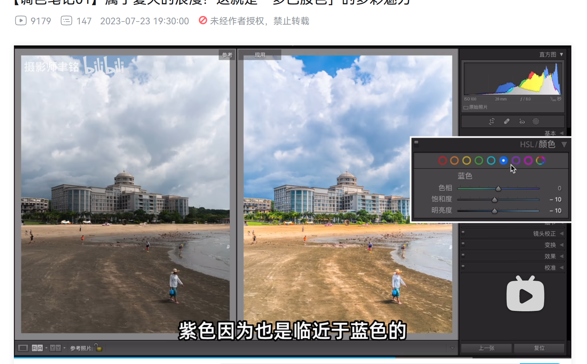
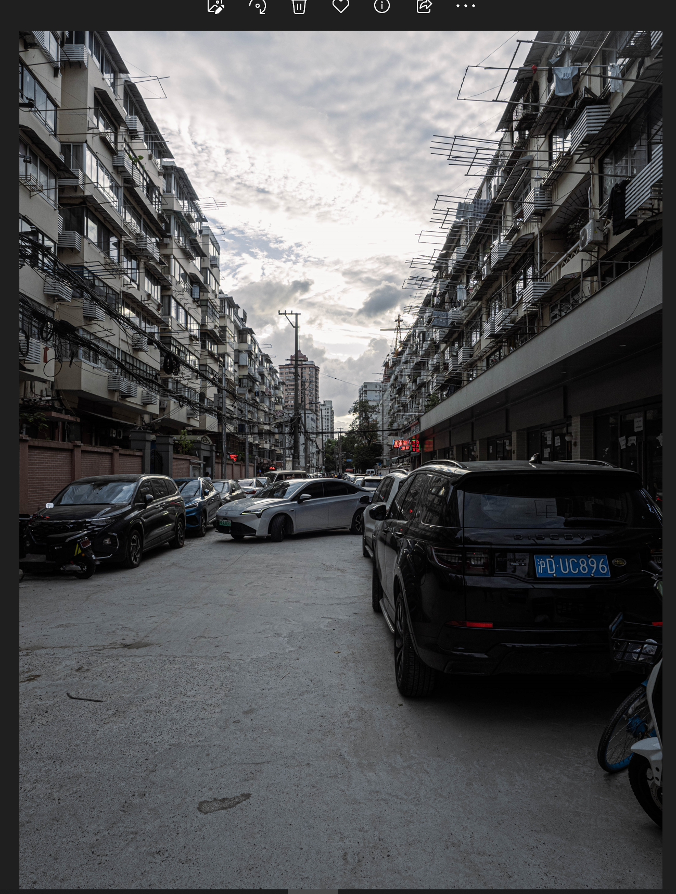

## 调色基本

5大条
- 对比度:让亮的更亮让暗的更暗(影响颜色)
- 清晰度:让轮廓附近的对比度更大,并且赋予明度渐变带 影响画面中高频区域 影响物体表面和边缘(影响轮廓线附近的颜色)
- 锐度:在轮廓出现一个像素的明度反差,十分分明(不影响颜色)
- 去朦胧:整体向暗部偏移, 去朦胧影响色彩, 影响区域大于清晰度
- 纹理:影响画面的中频区域, 影响物体表面细节 几乎不影响色彩

## 糖果色

顺序操作

大幅拉高阴影和黑色色阶  
小幅度拉高白色色阶  
降低高光防止溢出  
提升对比度  
提高清晰度(让画面的线条感更硬朗,有种画笔勾边的感觉)  
降低去朦胧使画面更柔和  
(压低去朦胧之后画面变亮)降低曝光  
拉高鲜艳与饱和

进入hsl面板  
压低过于鲜艳的非主体色 去除青色  
提高亮度  

降低锐度?  
消除噪点和杂色

适当蒙版(在都调整好后)

## 适用于老旧街区的

拉高清晰度 适当拉高纹理  
降低去朦胧并降低曝光  
对比度增强  
降低饱和 大降低鲜艳  
上下线性蒙版降低高光与阴影  
