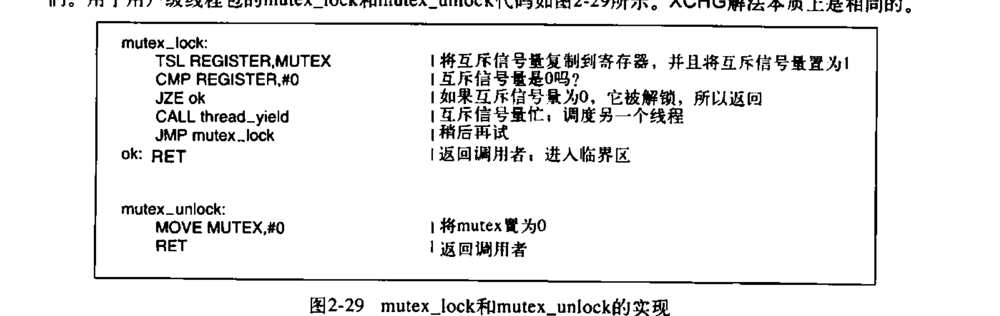
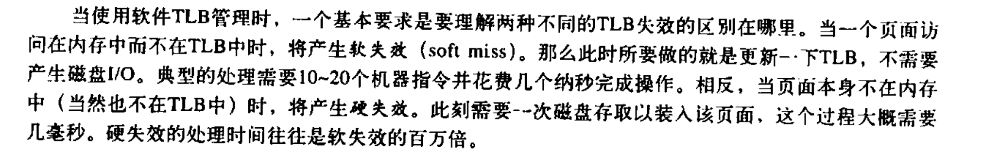
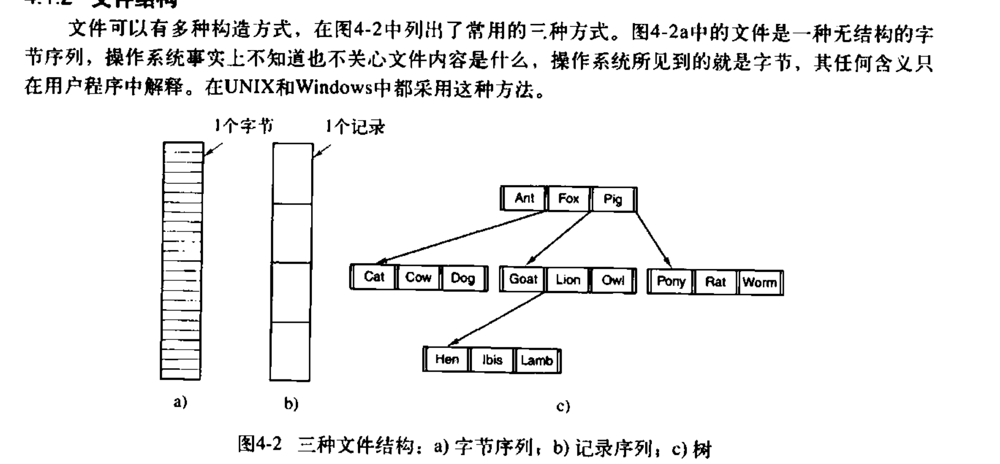
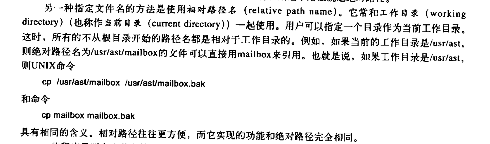

### 2.2线程

对于多线程  
a调用过程,过程写入errno,a读出errno判断结果  
b写入errno

在a的写入过后执行b  
导致b写入后更改了errno的值使得a错误执行

解决方法:

**全局变量管理器**

通过create_global('唯一id') 来创建一个全局变量  
而后写入使用的是 set_global('id',value)  
读出使用 a = read_global('id')

如果另一个线程用同样的代码访问了'相同id'的全局变量  
则会因为他们处于不同的存储单元而不会互相冲突

**不可重入**

第二次调用不可以发生在第一次调用结束之前

普通的解决方案:  
为每个过程使用一个包装器: 调用过程的时候检查包装器设置的值来看是否所有的其他调用都已经结束(类似于锁)

**线程专用信号**(?)

线程调用alarm的时候 内核不知道该传给哪个用户态线程

**信号处理的冲突**

有些线程想要捕捉ctrl c 而另一些线程想要用ctrl c终止整个进程

**堆栈管理**

用户态线程堆栈即将溢出时内核并不知情, 不能使他们自动增长  
最后会溢出

### 2.3进程通信

**竞争条件**

a读到ok后被cpu挂起  
b也读到ok , 紧接着b写入, b结束  
a同样写入相同位置, b被覆盖

称对共享内存进行访问的程序为临界区域


解决方案:

屏蔽中断不好:  
1 万一搞错就会终结系统(单核)
2 多核系统中 屏蔽单个cpu不能阻止其他cpu访问

锁变量

轮换(令牌桶)  
容易出现某个进程被临界区外的另一个不想立刻进入临界区的进程阻塞

peterson解法

**TSL指令:读锁和写锁是不可分割的操作**


**XCHG:原子化地交换两位**


睡眠等待(挂起)  
设置一个睡眠量记录器(信号量Dijkstra):  
对一个应当睡眠的进程执行down则将信号量降低1  
如果信号量为0则将进程睡眠  
对一个应当被唤醒的进程执行up则将信号量+1  

down与up操作同样可以用在锁上  
生产者-消费者问题:内存满了生产者休眠 内存空了消费者休眠  
休眠的时机来自于信号量:空槽数 满槽数

其中 down up 与信号量的检测必须合起来是一个原子操作

**互斥量** mutex

互斥量和锁的区别:
enter_region会让取锁失败的线程永远循环 , 不给拥有锁的线程释放锁  
mutex_lock 在取锁失败时会直接thread_yield给其他线程



**如何在进程之间共享重要的 互斥量 信号量等?**

1 信号量可以放在内核中 并只能通过系统调用来访问  
2 os提供了进程之间的共享地址空间 实在不行可以用共享文件


pthread 的另一个同步机制 : **条件变量**  
允许线程因为一些未达到的条件而阻塞


死锁的产生

生产者:先down empty再down mutex(进入临界区)  
消费者:先down full再down mutex 再 up empty

上面不会产生死锁

生产者:先down mutex再down empty  
消费者:先down full再down mutex 再 up empty

缓冲区满了后生产者卡在empty上  
而mutex也被设置为0 消费者卡在mutex上

产生死锁

**管程**

任意时刻中管程中只能有一个活跃进程

>典型的处理方法是，当一个进程调用管程过程时，该过程中的前几条指令将检查在管程中是否有其他的活跃进程。如果有，调用进程将被挂起，直到另一个进程离开管程将其唤醒。如果没有活跃进程在使用管程，则该调用进程可以进人

>进入管程时的互斥由编译器负责，但通常的做法是用一个互斥量或一元信号量。因为是由编译器而非程序员来安排互斥，所以出错的可能性要小得多。在任一时刻，写管程的人无须关心编译器是如何实现互斥的。他只需知道将所有的临界区转换成管程过程即可，决不会有两个进程同时执行临界区中的代码

除此之外, 还需要让进程在无法继续运行时被阻塞(生产者-消费者问题)  
引入条件变量:  
1管程过程发现它无法继续运行(如生产者发现缓冲区满)  
2该过程执行wait并等待一个signal  
3wait使自身阻塞并让另一个等待中的进程调入

4在其他管程过程发出signal后立即退出(相当于yield)  
5继续执行等待signal的过程

**条件变量没有办法存储信号量,因此signal必须在一个进程wait之后才能被接受**  
但可以在发送signal之前检查接收进程的状态来判断是否必要发送signal

>读者可能会觉得wait和signal操作看起来像前面提到的sleep和wakeup，而我们已经看到后者存在严重的竞争条件。是的，它们确实很像，但是有个很关键的区别: sleep和wakeup之所以失败是因为当一个进程想睡眠时另一个进程试图去唤醒它。  
>使用管程则不会发生这种情况。对管程过程的自动互斥保证了这·一点:如果管程过程中的生产者发现缓冲区满，它将能够完成wait操作而不用担心调度程序可能会在wait完成之前切换到消费者。甚至，在wait执行完成而且把生产者标志为不可运行之前，根本不会允许消费者进入管程。

>Java是一种面向对象的语言，它支持用户级线程，还允许将方法(过程)划分为类。只要将关键词synchronized加人到方法声明中，Java 保证一旦某个线程执行该方法，就不允许其他线程执行该对象中的任何synchronized方法。

如果真的需要用管程 , 就必须要使用一个支持了管程的语言

在分布式系统中:多cpu 多内存  
信号量的 TSL 和 XCHG 将会失效(但管程仍然可用?)

**消息传递**

解决生产消费者问题:  
类似于集装箱:  
消费者:只有在仍有内容消息时才能消费,并发送给生产者一个空消息  
生产者:只有在仍有空消息时才能生产,并发送一个内容消息

地址问题:  
使用进程编号 或是建立一个信箱地址  
信箱满后, 其他向此信箱发送的消息都会被挂起


**屏障**

>在有些应用中划分了若干阶段，并且规定，除非所有的进程都就绪准备着手下一个阶段，否则任何进程都不能进入下一个阶段。

### 2.4调度

>进程切换的代价是比较高的。首先用户态必须切换到内核态，然后要保存当前进程的状态，包括在进程表中存储寄存器值以便以后重新装载。在许多系统中，内存映像(例如，页表内的内存访问位)也必须保存，接着，通过运行调度算法选定一个新进程，之后，应该将新进程的内存映像重新装入MMU，最后新进程开始运行。除此之外，进程切换还要使整个内存高速缓存失效，强迫缓存从内存中动态重新装人两次(进入内核一次离开内核一次)。

调度时机:  
- 创建新进程 运行父进程 or 运行子进程  
- 一个进程退出后 运行其他的就绪进程  
- 当一个进程因为I\/O而阻塞等, 选择其他进程运行
- 当一个I\/O中断发生时, 某个进程就绪了

非抢占式调度算法:让进程运行直到被阻塞 or 自己释放cpu  
在时钟中断发生时, 如果没有更高优先级的进程正在等待到时, 被中断的进程继续运行

抢占式: 分给每个进程一个最大时间片 , 到时间了自动被挂起, 以便把cpu控制还给调度程序

**不同的调度算法服务于不同的目的**

批处理:长时抢占式 和 非抢占式都可以接受  
服务器(交互式):抢占式(为了处理许多突发服务)  
实时系统: 非抢占式


最短作业优先调度的方法只在所有作业同时就绪的情况下 平均完成时间最优  
最短剩余时间优先

轮转调度:相当于令牌桶 : 每个进程被分配一个时间片  
进程挂起时机:
- 用光时间片
- 阻塞

长时间片使cpu利用率更高  
短时间片让作业更公平  
并且如果时间片长于发生阻塞的时间, 则避免了抢占, 提高效率

优先级调度: 在滴答时降低当前进程的优先级, 如果当前进程优先级不是最高, 则挂起

nice命令更改优先级

**优先级类**

运行优先级 和 单次运行时间片长度成反比:  
如果在分配1时间片时消耗完毕 则降低一级优先级并分配两倍时间片

>对于那些刚开始运行一段长时间，而后来又需要交互的进程，为了防止其永远处于被惩罚状态，可以采取下面的策略。只要终端上有回车键 (Enter键)按下，则属于该终端的所有进程就都被移到最高优先级，这样做的原因是假设此时进程即将需要交互


**最短作业优先** 实现方式


**保证调度** 时间片为 1/进程数


**彩票调度**


**公平分享调度**

按照用户公平而不按照进程公平

#### 实时系统

硬实时: 不能错过任何ddl  
软实时: 允许偶尔错过ddl

周期事件: 如果 处理事件\*发生频率 的和 小于 1  
则称之为可调度的(此时假设上下文切换开销很小)

**调度机制和调度策略分离** 通过其他方法得知哪个子进程更为紧迫

```
实时系统缺乏一个时钟中断来让过长的线程自行结束
```


50ms时间片分给进程A让A自由分配和  
内核级线程的类似调度

*从A1切换到A2比从A1切换到B1开销更小*

# 第三章存储

避免使用绝对的内存地址导致内存装载的时候跳到错误的位置  
使用静态重定位技术

>它的工作方式如下，当一个程序被装载到地址16 384时，常数16 384被加到每一个程序地址上。虽然这个机制在不出错误的情况下是可行的，但这不是一种通用的解决办法，同时会减慢装载速度

处理内存超载使用 **交换系统** : 把被挂起的进程的内存内容放在磁盘上


这种方案会需要特别地去解决进程内存自动增长的问题  

>若该进程与一个空闲区相邻，那么可把该空闲区分配给该进程让它在这个空闲区增大。另一方面，若进程相邻的是另一个进程，那么要么把需要增长的进程移到内存中一个足够大的区城中去，要么把一个或多个进程交换出去，以便生成一个足够大的空闲区。若一个进程在内存中不能增长，而且磁盘上的交换区也已满了，那么这个进程只有挂起直到一些空间空闲(或者可以结束该进程)。


因此os可以为增长预留空间  
但在交换时把预留的空间也全部交换出去是一种浪费

**记录空闲内存**

方法
- 位图法:按bit的倍数分割内存单元 用位图记录空闲状态(bit map)
- 使用链表记录 (空闲 or 占用) \| (起始位置) \| (长度) \| (下一个)
- 快速适配


**虚拟内存**

覆盖


**内存管理单元 MMU**


页面和页框的大小通常是一致的  
此时 MMU 会把所有 0\~4095 的有效请求映射到 8192\~12287

当程序需要访问一个不在页框中的页面  
MMU缺页中断  
CPU陷入陷入操作系统  
选择一个页框放弃掉 并载入需要的新的页面  

以二的幂作为页框长度有好处:


左侧的值被用作虚拟页面的索引  
右侧的值被直接复制到物理地址的映射

>例如，对于16位地址和4KB 的页面大小，高4位可以指定16个虚拟页面中的一页，而低12位接着确定了所选页面中的字节偏移量 (0~4095)。但是使用3或者5或者其他位数拆分虚拟地址也是可行的。不同的划分对应不同的页面大小。


说明
- 在\/不在 位  
如果不在(0)会引发缺页中断
- 保护位 读 写 执行
- 修改位 :  
在重新分配页框时 如果一个数据已经被修改,那就必须要写回磁盘  
而如果只是读过了, 就只需要删除
- 访问位 : 为操作系统选择哪个页面应当丢弃时作为参考
- 禁用高速缓存位 : 保证能够从设备实时地读出内容而不是用缓存中的内容

为了降低**寄存器操作**时候对内存的访问  
(寄存器操作需要先查页表 而后才能知道具体修改哪个寄存器)

TLB 转换检测缓冲区 减少反复读取内存的开销(是硬件解决方案) 

TLB管理软件:  
同样为了减少TBL失效发生的概率(类似于缺页中断)  
发展出了TBL预测



大内存页表  
多级页表: 10位找页表1 10位在子页表2索引 12位是偏移量  
倒排页表(?): 在64位系统中用的比较多

页面置换问题  
在发生缺页中断的时候需要把内存中的某个页面移出  
1. 最近未使用置换NRU  
在每一段滴答时随机清除页面的访问位  
修改位不改动  
发生置换时, 优先干掉访问位为 0 的页面
2. 先进先出FIFO  
3. 第二次机会  
最老的页面的访问位是否是 0?
如果是 1  
那么就把访问位置为 0   
然后视为新放入的页面 (后进入的页面)
4. 时钟页面  (是第二次机会的优雅版本)  

5. 最少使用页面LRU  
记录使用次数代价高昂  
使用硬件: 使用次数计数器(甚至无需考虑溢出问题)  

6. 软件模拟的LRU \-最不常用页面(NFU)的改版  
将访问位(0 or 1)放在计数器最左   
将所有的计数器位 向右移动一位 (aging过程)
就可以时刻移除最少访问的页面
7. 工作集算法  
进程当前正在使用的页面称作工作集  
挂起一个进程并且将他的页面都移除内存后  
原则上重新启动之会发出非常多的缺页中断  
在进程工作前预先调入他的页面 (**预先调页**)  
1  
一个可行的算法是  
   
访问后设置访问位为 1  
在一次滴答后检查访问位:
- 若为1 则: 变成0 并且把上次访问时间更新
- 若为0 则: 
    - 如果上次访问时间过于久 则可以被删除
    - 如果上次访问时间不够久, 就不删除
- 如果扫描一圈发现全都在工作集中, 就优先删除 够久的 其次删除 不够久的
8. 类似的, 工作集算法可以被升级成 **工作集时钟算法**  
  
如果没能在转一圈之后置换任何页面 和一般工作集法同理操作

### 分页系统置换策略问题(公平性)

全局算法和局部算法  
一个只能用预先分配的页框  
一个可以用任意内存中的页框

**全局方法**

进程进程平等  
按进程大小分配  
**按*缺页中断率* 分配**  

或者是在缺页中断率过高时将更多进程挂起

页面大小  
没有最优的页面大小  
选择小页面的理由:
- 最后的页面可能有一半都是无用的 (内部碎片 internal fragmentation)
- 一个小程序可以需要更少的工作集

选择大页面的理由  
- 小页面需要太多的页表 (内存和磁盘的传输多是一次一页, 因此大部分时间都花在了*寻道* 和*旋转延迟* 上)
- 小页面可能占据过多宝贵的TLB空间


I空间和D空间:  
一个内存放指令(有单独分页)  
另一个放data(同样有单独分页)

在UNIX 中 使用fork生成子进程后, 子进程会和父进程共享数据页面集合, 他们会有各自的页表, 但指向同一个页面集合  
这个时候, copy on write

### 动态链接库

### 内存映射文件


### 分页守护进程 (清除策略)

空闲页框过少便提前干掉一些页面  
保证空闲页框没必要在移作他用的时候再往磁盘中写回一次

### 虚拟内存接口 (使程序员能够对内存映射进行控制)

### 中断时在做什么


p132 指令备份是什么??


### 内存中的分段存储

把相似数据类型的内容存储在同一个段  
这样在浮动在扩张时, 内存可以立即腾出空间来

除此之外  
分段后  第n段的内容如果被重新编译  
也不需要对其他的过程的起始偏移量进行任何修改

分段也有助于进程之间共享过程和数据  
一个例子是**共享库**

同样 一个过程段可以只允许执行  
一个浮点段可以只允许读  
逻辑上对内存进行分段方便了管理  


上面就是x86

# 第四章文件系统




>当用磁盘来存储文件时，我们可以不按顺序地读取文件中的字节或记录，或者按照关键字而不是位置来存取记录。这种能够以任何次序读取其中字节或记录的文件称作随机访问文件(random access file)许多应用程序需要这种类型的文件。

随机访问文件 如数据库系统:  
用户要能不在查询到他的机票信息之前访问所有的机票信息

### 属性 元数据


绝对路径 相对路径和工作路径



>每个进程都有自己的工作目录，这样在进程改变工作目录并退出后，其他进程不会受到影响，文件系统中也不会有改变的痕迹。对进程而言，切换工作目录是安全的，所以只要需要，就可以改变当前工作目录。

>如果改变了库过程的工作目录，并且工作完毕之后没有修改回去，则其他程序有可能无法正常运行，因为它们关于当前目录的假设已经失效。


有一种link 是硬链接  
unix中的link 和 win 的快捷方式是 符号连接


MBR 主引导记录  
用于引导计算机

每个分区都从一个引导快开始  
虽然可能此分区暂时还没有可以引导的操作系统  
但为之后的可能性预留空间

超级块包含分区的文件系统的所有参数  
在计算机启动时, 会被加载

空闲空间用位图或者指针列表的形式给出

>(?)后面也许跟随的是一组i节点，这是一个数据结构数组，每个文件一个，i节点说明了文件的方方面面。


>由于每个文件都必须有一个inode，因此有可能发生inode已经用光，但是硬盘还未存满的情况。这时，就无法在硬盘上创建新文件。   
每个inode都有一个号码，操作系统用inode号码来识别不同的文件。   
这里值得重复一遍，Unix/Linux系统内部不使用文件名，而使用inode号码来识别文件。对于系统来说，文件名只是inode号码便于识别的别称或者绰号。  
表面上，用户通过文件名，打开文件。实际上，系统内部这个过程分成三步：首先，系统找到这个文件名对应的inode号码；其次，通过inode号码，获取inode信息；最后，根据inode信息，找到文件数据所在的block，读出数据。

>一般情况下，文件名和inode号码是"一一对应"关系，每个inode号码对应一个文件名。但是，Unix/Linux系统允许，多个文件名指向同一个inode号码。  
这意味着，可以用不同的文件名访问同样的内容；对文件内容进行修改，会影响到所有文件名；但是，删除一个文件名，不影响另一个文件名的访问。这种情况就被称为"硬链接"（hard link）。

>除了硬链接以外，还有一种特殊情况。  
文件A和文件B的inode号码虽然不一样，但是文件A的内容是文件B的路径。读取文件A时，系统会自动将访问者导向文件B。因此，无论打开哪一个文件，最终读取的都是文件B。这时，文件A就称为文件B的"软链接"（soft link）或者"符号链接（symbolic link）。  
这意味着，文件A依赖于文件B而存在，如果删除了文件B，打开文件A就会报错："No such file or directory"。这是软链接与硬链接最大的不同：文件A指向文件B的文件名，而不是文件B的inode号码，文件B的inode"链接数"不会因此发生变化。


### 记录文件 文件存储
- 连续分配  
需要在文件创建时申明文件的最大大小  
产生很多不可用碎片
- 链表分配  
从第一个文件块指向最尾端文件块  
随机访问成为灾难  
指针占去了一些字节使得块的大小不是2的幂  
这会导致一些降速
- 文件分配表 FAT  
把文件链表指针存在内存中  
这样和链表分配的区别不大  
并且由于指针存放在内存中, 所以随机访问的速度更快了  
但由于必须要把所有的表都放在内存中, 占用空间较高
- i节点  
(?)没看懂!  


### 如何实现可变长文件名?

- 可变文件头部  
这个文件头部和属性一样, 是被存在目录内的  
可变文件长度导致内存会被分为更多更小的空隙  
同时, 一个目录过长会导致读入的时候发生缺页中断
- 目录自身长度固定, 文件名处指针指向一个文件名堆  
空隙问题得到了一般的解决  
但同样会发生缺页中断问题  


查找文件名加速: 使用散列表

### 共享文件问题

为了使不同的目录下出现 **同一个文件**

UNIX:  目录指向一个小型数据结构(小型数据结构即i节点)  
或者使用link 创建符号链接

i节点的问题是 : 共享的任何一方删除之 只会让引用计数器 \-1  
因此不能共享删除操作

符号链接需要额外的开销(?)  


共享文件 : 一份文件被两次复制的问题

### 日志结构文件系统

>在大多数文件系统中，写操作往往都是零碎的。一个50us的磁盘写操作之前通常需要10ms的寻道时间和4ms的旋转延迟时间，可见零碎的磁盘写操作是极其没有效率的。根据这些参数，磁盘的效率降低到1%以下

>为了看看这样小的零碎写操作从何而来，考虑在UNIX文件系统上创建一个新文件。为了写这个文件，必须写该文件目录的i节点、目录块、文件的i节点以及文件本身。而这些写操作都有可能被延迟那么如果在写操作完成之前发生死机，就可能在文件系统中造成严重的不一致性。正因为如此，i节点的写操作一般是立即完成的。

删除文件三个步骤:
- 在目录中删除文件
- 释放i节点到空闲i节点池
- 将所有磁盘块归还空闲磁盘块池

>在Windows中，也需要类似的步骤。不存在系统崩溃时，这些步骤执行的顺序不会带来问题，但是当存在系统崩溃时，就会带来问题。假如在第一步完成后系统崩溃。i节点和文件块将不会被任何文件获得也不会被再分配，它们只存在于废物池中的某个地方，并因此减少了可利用的资源。如果崩墙发生在第一步后，那么只有磁盘块会丢失。
>
>如果操作顺序被更改，并且i节点最先被释放，这样在系统重启后，i节点可以被再分配，但是旧的目录入口将继续指向它，因此指向错误文件。如果磁盘块最先被释放，这样一个在i节点被清除前的系统崩溃将意味着一个有效的目录入口指向一个i节点，它所列出的磁盘块当前存在于空闲块存储池中并可能很快被再利用。这将导致两个或更多的文件分享同样的磁舟块。这样的结果都是不好的


### 虚拟文件系统 VFS

抽象出所有文件系统所共有的部分  
让文件系统看起来像是同一个东西

VFS保留了原语和操作其他文件系统原语的能力

