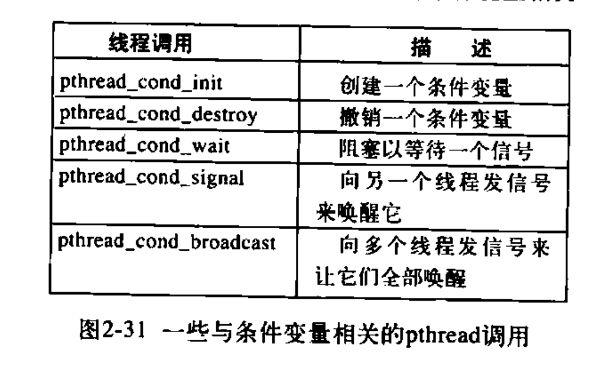

### 2.2线程

对于多线程  
a调用过程,过程写入errno,a读出errno判断结果  
b写入errno

在a的写入过后执行b  
导致b写入后更改了errno的值使得a错误执行

解决方法:

**全局变量管理器**

通过create_global('唯一id') 来创建一个全局变量  
而后写入使用的是 set_global('id',value)  
读出使用 a = read_global('id')

如果另一个线程用同样的代码访问了'相同id'的全局变量  
则会因为他们处于不同的存储单元而不会互相冲突

**不可重入**

第二次调用不可以发生在第一次调用结束之前

普通的解决方案:  
为每个过程使用一个包装器: 调用过程的时候检查包装器设置的值来看是否所有的其他调用都已经结束(类似于锁)

**线程专用信号**(?)

线程调用alarm的时候 内核不知道该传给哪个用户态线程

**信号处理的冲突**

有些线程想要捕捉ctrl c 而另一些线程想要用ctrl c终止整个进程

**堆栈管理**

用户态线程堆栈即将溢出时内核并不知情, 不能使他们自动增长  
最后会溢出

### 2.3进程通信

**竞争条件**

a读到ok后被cpu挂起  
b也读到ok , 紧接着b写入, b结束  
a同样写入相同位置, b被覆盖

称对共享内存进行访问的程序为临界区域


解决方案:

屏蔽中断不好:  
1 万一搞错就会终结系统(单核)
2 多核系统中 屏蔽单个cpu不能阻止其他cpu访问

锁变量

轮换(令牌桶)  
容易出现某个进程被临界区外的另一个不想立刻进入临界区的进程阻塞

peterson解法

**TSL指令:读锁和写锁是不可分割的操作**


**XCHG:原子化地交换两位**


睡眠等待(挂起)  
设置一个睡眠量记录器(信号量Dijkstra):  
对一个应当睡眠的进程执行down则将信号量降低1  
如果信号量为0则将进程睡眠  
对一个应当被唤醒的进程执行up则将信号量+1  

down与up操作同样可以用在锁上  
生产者-消费者问题:内存满了生产者休眠 内存空了消费者休眠  
休眠的时机来自于信号量:空槽数 满槽数

其中 down up 与信号量的检测必须合起来是一个原子操作

**互斥量** mutex

互斥量和锁的区别:
enter_region会让取锁失败的线程永远循环 , 不给拥有锁的线程释放锁  
mutex_lock 在取锁失败时会直接thread_yield给其他线程


**如何在进程之间共享重要的 互斥量 信号量等?**

1 信号量可以放在内核中 并只能通过系统调用来访问  
2 os提供了进程之间的共享地址空间 实在不行可以用共享文件


pthread 的另一个同步机制 : **条件变量**  
允许线程因为一些未达到的条件而阻塞



死锁的产生

生产者:先down empty再down mutex(进入临界区)  
消费者:先down full再down mutex 再 up empty

上面不会产生死锁

生产者:先down mutex再down empty  
消费者:先down full再down mutex 再 up empty

缓冲区满了后生产者卡在empty上  
而mutex也被设置为0 消费者卡在mutex上

产生死锁

**管程**

任意时刻中管程中只能有一个活跃进程

>典型的处理方法是，当一个进程调用管程过程时，该过程中的前几条指令将检查在管程中是否有其他的活跃进程。如果有，调用进程将被挂起，直到另一个进程离开管程将其唤醒。如果没有活跃进程在使用管程，则该调用进程可以进人

>进入管程时的互斥由编译器负责，但通常的做法是用一个互斥量或一元信号量。因为是由编译器而非程序员来安排互斥，所以出错的可能性要小得多。在任一时刻，写管程的人无须关心编译器是如何实现互斥的。他只需知道将所有的临界区转换成管程过程即可，决不会有两个进程同时执行临界区中的代码

除此之外, 还需要让进程在无法继续运行时被阻塞(生产者-消费者问题)  
引入条件变量:  
1管程过程发现它无法继续运行(如生产者发现缓冲区满)  
2该过程执行wait并等待一个signal  
3wait使自身阻塞并让另一个等待中的进程调入

4在其他管程过程发出signal后立即退出(相当于yield)  
5继续执行等待signal的过程

**条件变量没有办法存储信号量,因此signal必须在一个进程wait之后才能被接受**  
但可以在发送signal之前检查接收进程的状态来判断是否必要发送signal

>读者可能会觉得wait和signal操作看起来像前面提到的sleep和wakeup，而我们已经看到后者存在严重的竞争条件。是的，它们确实很像，但是有个很关键的区别: sleep和wakeup之所以失败是因为当一个进程想睡眠时另一个进程试图去唤醒它。  
>使用管程则不会发生这种情况。对管程过程的自动互斥保证了这·一点:如果管程过程中的生产者发现缓冲区满，它将能够完成wait操作而不用担心调度程序可能会在wait完成之前切换到消费者。甚至，在wait执行完成而且把生产者标志为不可运行之前，根本不会允许消费者进入管程。

>Java是一种面向对象的语言，它支持用户级线程，还允许将方法(过程)划分为类。只要将关键词synchronized加人到方法声明中，Java 保证一旦某个线程执行该方法，就不允许其他线程执行该对象中的任何synchronized方法。

如果真的需要用管程 , 就必须要使用一个支持了管程的语言

在分布式系统中:多cpu 多内存  
信号量的 TSL 和 XCHG 将会失效(但管程仍然可用?)

**消息传递**

解决生产消费者问题:  
类似于集装箱:  
消费者:只有在仍有内容消息时才能消费,并发送给生产者一个空消息  
生产者:只有在仍有空消息时才能生产,并发送一个内容消息

地址问题:  
使用进程编号 或是建立一个信箱地址  
信箱满后, 其他向此信箱发送的消息都会被挂起


**屏障**

>在有些应用中划分了若干阶段，并且规定，除非所有的进程都就绪准备着手下一个阶段，否则任何进程都不能进入下一个阶段。

### 2.4调度

>进程切换的代价是比较高的。首先用户态必须切换到内核态，然后要保存当前进程的状态，包括在进程表中存储寄存器值以便以后重新装载。在许多系统中，内存映像(例如，页表内的内存访问位)也必须保存，接着，通过运行调度算法选定一个新进程，之后，应该将新进程的内存映像重新装入MMU，最后新进程开始运行。除此之外，进程切换还要使整个内存高速缓存失效，强迫缓存从内存中动态重新装人两次(进入内核一次离开内核一次)。

调度时机:  
- 创建新进程 运行父进程 or 运行子进程  
- 一个进程退出后 运行其他的就绪进程  
- 当一个进程因为I\/O而阻塞等, 选择其他进程运行
- 当一个I\/O中断发生时, 某个进程就绪了

非抢占式调度算法:让进程运行直到被阻塞 or 自己释放cpu  
在时钟中断发生时, 如果没有更高优先级的进程正在等待到时, 被中断的进程继续运行

抢占式: 分给每个进程一个最大时间片 , 到时间了自动被挂起, 以便把cpu控制还给调度程序

**不同的调度算法服务于不同的目的**

批处理:长时抢占式 和 非抢占式都可以接受  
服务器(交互式):抢占式(为了处理许多突发服务)  
实时系统: 非抢占式


最短作业优先调度的方法只在所有作业同时就绪的情况下 平均完成时间最优  
最短剩余时间优先

轮转调度:相当于令牌桶 : 每个进程被分配一个时间片  
进程挂起时机:
- 用光时间片
- 阻塞

长时间片使cpu利用率更高  
短时间片让作业更公平  
并且如果时间片长于发生阻塞的时间, 则避免了抢占, 提高效率

优先级调度: 在滴答时降低当前进程的优先级, 如果当前进程优先级不是最高, 则挂起

nice命令更改优先级

**优先级类**

运行优先级 和 单次运行时间片长度成反比:  
如果在分配1时间片时消耗完毕 则降低一级优先级并分配两倍时间片

>对于那些刚开始运行一段长时间，而后来又需要交互的进程，为了防止其永远处于被惩罚状态，可以采取下面的策略。只要终端上有回车键 (Enter键)按下，则属于该终端的所有进程就都被移到最高优先级，这样做的原因是假设此时进程即将需要交互


**最短作业优先** 实现方式


**保证调度** 时间片为 1/进程数


**彩票调度**


**公平分享调度**

按照用户公平而不按照进程公平

#### 实时系统

硬实时: 不能错过任何ddl  
软实时: 允许偶尔错过ddl

周期事件: 如果 处理事件\*发生频率 的和 小于 1  
则称之为可调度的(此时假设上下文切换开销很小)

**调度机制和调度策略分离** 通过其他方法得知哪个子进程更为紧迫

```
实时系统缺乏一个时钟中断来让过长的线程自行结束
```


50ms时间片分给进程A让A自由分配和  
内核级线程的类似调度

*从A1切换到A2比从A1切换到B1开销更小*

# 第三章存储器抽象

避免使用绝对的内存地址导致内存装载的时候跳到错误的位置  
使用静态重定位技术

>它的工作方式如下，当一个程序被装载到地址16 384时，常数16 384被加到每一个程序地址上。虽然这个机制在不出错误的情况下是可行的，但这不是一种通用的解决办法，同时会减慢装载速度

